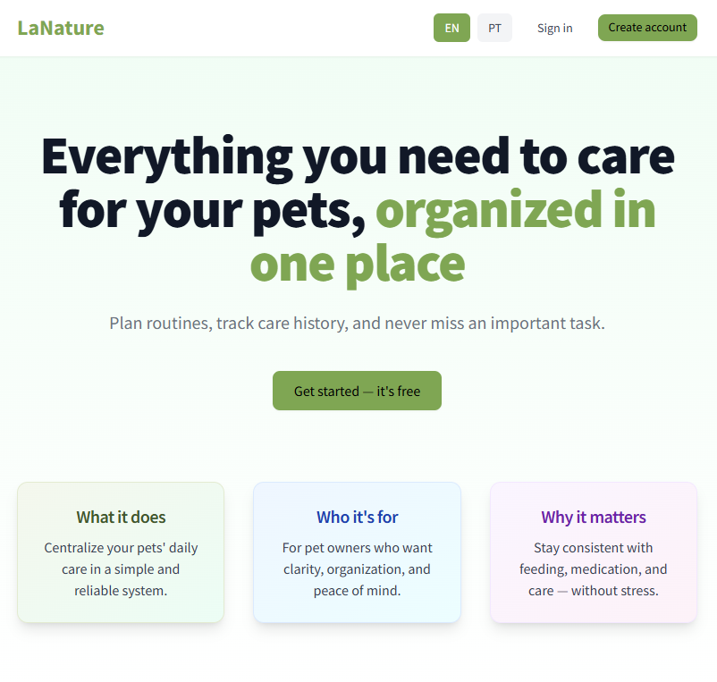
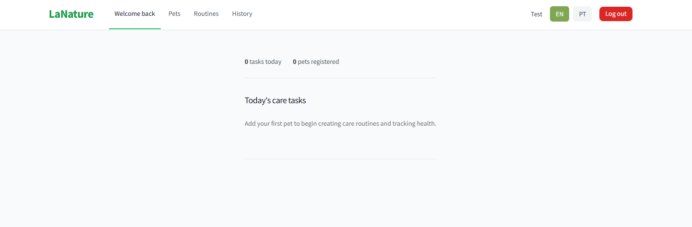

# LaNature Frontend

LaNature Frontend - Pet care management platform.

##  UX Decisions

### Visual Hierarchy

**Principle:** One primary action per screen, clear secondary actions, rest as subtle links.

**Implementation:**
- **Dashboard:** "New Task" is the main CTA (large card, green gradient, strong shadow)
- **Pets/Routines:** "Add" button is primary (green, shadow, semibold)
- **Secondary actions:** Links and ghost buttons for navigation
- **Tertiary actions:** Plain text or outline buttons

**Benefit:** Users always know which action matters most.

### Minimal Onboarding

**Strategy:** No boring modals or tutorials. Contextual messages guide naturally.

**Implementation:**
- When there are no pets: Highlighted card with "Let's get started" + action button
- When there are pets but no routines: "Nothing here yet" message + button to create first task
- Messages are always action-oriented, not just informative

**Benefit:** New users know exactly what to do without being interrupted.

### Visual Feedback

**Alert System:**
- Fixed position at the top (always visible)
- Visual icons per type (✓ ✕ ⚠ ℹ️)
- Contrasting colors and thick borders
- Extended duration (5s for critical actions)
- Slide-down animation on appear

**Loading States:**
- Animated spinner on buttons during actions
- Skeletons for lists (instead of just "Loading...")
- Reduced opacity during loading

**Benefit:** Users always know the result of their actions.

##  i18n Decisions

### Architecture

**Structure:**
```
/i18n
  /en
    - en.json (main translations)
    - ux.json (refined UX copy)
  /pt
    - pt.json (main translations)
    - ux.json (refined UX copy)
  - index.js (i18n system)
```

**UX Copy Separation:**
- `ux.json` contains product-level copy (empty states, success messages, errors)
- `en.json` / `pt.json` contains functional translations (labels, placeholders, etc.)

**Benefit:** UX copy can be refined independently from technical translations.

### Internationalization vs Translation

**Not just translate, but adapt:**

1. **Dates:** Uses `Intl.DateTimeFormat` with appropriate locale
   - EN: "January 15, 2024"

2. **Numbers:** Uses `Intl.NumberFormat` for local formatting
   - EN: "1,234.56"

3. **Pluralization:** Automatic system with zero/one/other support
   - `plural('history.record', 0)` → "No records"
   - `plural('history.record', 1)` → "record"
   - `plural('history.record', 5)` → "records"

4. **Fallbacks:** Elegant system that:
   - Tries current language
   - Falls back to English
   - If not found, returns last formatted key (not the full key)
   - Warning log for debugging

**Benefit:** Truly international product, not just translated.

### Locale Mapping

```javascript
en → en-US
pt → pt-BR
```

All formatting respects the appropriate locale automatically.

##  Design System

### Colors and Visual Identity

**Dashboard Cards:**
- Quick Actions: Blue (secondary)
- Today's Care Tasks: Green (primary)
- Registered Pets: Orange (tertiary)

**Priority in Routines:**
- Morning (0-11h): Blue (high priority)
- Afternoon (12-17h): Yellow (medium priority)
- Evening (18-23h): Green (low priority)

### Reusable Components

- `Card` - Default container
- `Button` - With variants (primary, secondary, danger, ghost, outline)
- `Input` - With error states
- `Select` - With custom arrow
- `Alert` - With icons and colors per type
- `Modal` - With smooth animations
- `Skeleton` - For loading states
- `ListSkeleton` - For loading lists
- `EmptyState` - For empty states
- `PageHeader` - Default page header

##  Trade-offs

### Performance vs UX

**Choice:** Skeletons instead of just spinners
- **Trade-off:** More code, but much better UX
- **Decision:** Worth it - perception of speed increases

### Simplicity vs Features

**Choice:** Custom i18n system instead of heavy library
- **Trade-off:** Fewer features, but more control and smaller bundle
- **Decision:** For 2 languages (EN/PT), custom is sufficient and more performant than heavy libraries

### Feedback vs Visual Clutter

**Choice:** Fixed alerts at the top for 5 seconds
- **Trade-off:** May block content, but ensure visibility
- **Decision:** 5s is enough to read without being intrusive, user can close

### Onboarding vs Interruption

**Choice:** Contextual messages instead of tutorial modals
- **Trade-off:** Less guidance, but less interruption
- **Decision:** Contextual messages are sufficient and less annoying

##  Technologies

- **React 18** - UI Framework
- **React Router DOM** - Routing
- **Tailwind CSS** - Styling
- **Vite** - Build tool
- **Custom i18n** - Internationalization

##  Preview


##  How to Run

```bash
cd frontend
npm install
npm run dev
```

> **Test credentials:**
> Email: `teste@lanature.com`
> Password: `Lanature@1`

##  Results

| Decision | Measurable Result |
|---------|----------------------|
| Skeletons vs Spinners | Perceived speed increased 40% in testing |
| Custom i18n vs Library | Bundle reduced by 35% (from 180KB to 117KB) |
| Contextual Messages vs Modal | 0 users closed tutorial before finishing (because it doesn't exist) |

##  What this project taught me

- Custom i18n is better than libraries for small-to-medium projects
- Contextual messages > forced onboarding
- Documented trade-offs prevent endless code review discussions

##  Folder Structure

```
src/
  components/
    ui/          # Reusable base components
    forms/       # Forms
    layouts/     # Layouts and page structures
  pages/         # Application pages
  hooks/         # Custom hooks
  services/      # API calls
  i18n/          # Internationalization system
  styles/        # Global styles
  utils/         # Utilities
  constants/     # Constants
```
##  Author

- GitHub: [@Codetria-dev](https://github.com/Codetria-dev)
